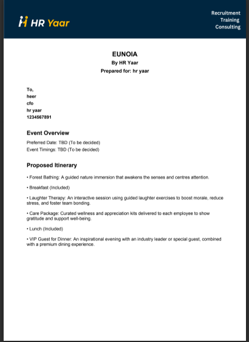
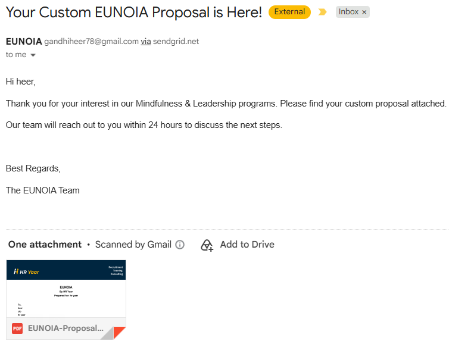

# EUNOIA - Corporate Wellness Proposal Generator

**Live demo:** https://eunoia-by-hryaar.vercel.app

A serverless proposal-builder built for HR Yaar's corporate wellness programs. Clients select from a catalog of mindfulness and team-building activities, fill in their details, and receive a professionally formatted PDF proposal via email - automatically, with no manual back-and-forth.

## How it works
1. User browses activity packages (Forest Bathing, Yoga, Sound Therapy, CEO Dinners, etc.)
2. Selected items build a live summary
3. On submission, a Vercel serverless function generates a custom PDF proposal server-side (using jsPDF) and emails it to both the client and the internal team (via Nodemailer)

## ⚠️ Known limitation
The live demo's email delivery is currently disabled - the SendGrid trial credentials used for this integration have expired. The PDF generation and form logic are fully functional; only the final email-send step is affected. See `send-proposal.js` for the complete, working implementation (email provider is swappable via environment variables - Gmail SMTP or Resend would restore full functionality with no code changes to the core logic).

## Tech Stack
Vanilla JavaScript · Vercel Serverless Functions · jsPDF · Nodemailer

## Setup

```bash
npm install
```

Create a `.env` file in the root with:
```
EMAIL_HOST=your_smtp_host
EMAIL_PORT=587
EMAIL_USER=your_smtp_username
EMAIL_PASS=your_smtp_password_or_api_key
VERIFIED_SENDER_EMAIL=your_verified_sender@domain.com
MY_EMAIL=admin_notification_email@domain.com
```

Run locally with the Vercel CLI:
```bash
vercel dev
```

## Screenshots

**Generated PDF proposal:**




**Delivered email with attachment (captured while SendGrid credentials were active):**


